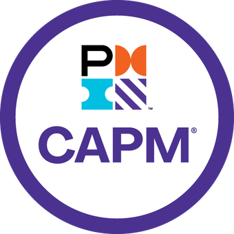
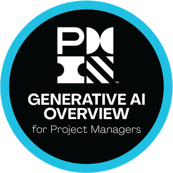
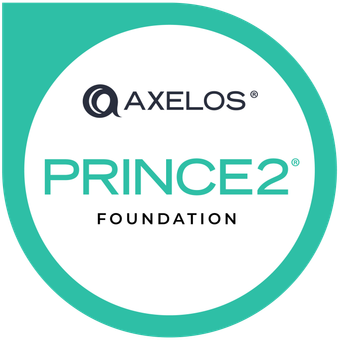
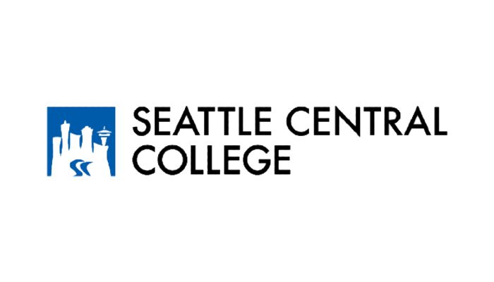
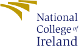

# Hi there, I'm Silvina Figueroa 👋

I'm a software developer passionate about driving process improvements and creating innovative solutions through technology. Known for finding creative solutions to solve problems, I thrive on learning new concepts and simplifying technical ideas for varied audiences.

## Skills
- **Programming Languages**:
  
  
  

- **Frameworks & Libraries**:
  
  
  

- **Web Technologies**:
  
  
  

- **Cloud & Infrastructure**:
  

- **Databases**:
  
  

- **Project Management Tools**:
  

## Certifications

  
  
  
  

## Education
<table style="border: none; background: none;">
  <tr style="border: none; background: none;">
    <td style="border: none; background: none;"></td>
    <td style="border: none; background: none;"><b>Software Engineer Training</b> (April 2024 - August 2024)</td>
  </tr>
  <tr style="border: none; background: none;">
    <td style="border: none; background: none;"></td>
    <td style="border: none; background: none;"><b>Certificate in Computing Science</b> (January 2023 - December 2023)</td>
  </tr>
  <tr style="border: none; background: none;">
    <td style="border: none; background: none;"></td>
    <td style="border: none; background: none;"><b>Higher Diploma in Computing Science</b> (January 2021 - January 2022)</td>
  </tr>
  <tr style="border: none; background: none;">
    <td style="border: none; background: none;"></td>
    <td style="border: none; background: none;"><b>MBA in Insurance and Reinsurance</b> (March 2018 - December 2020)</td>
  </tr>
</table>

## Let's Connect

  
  

